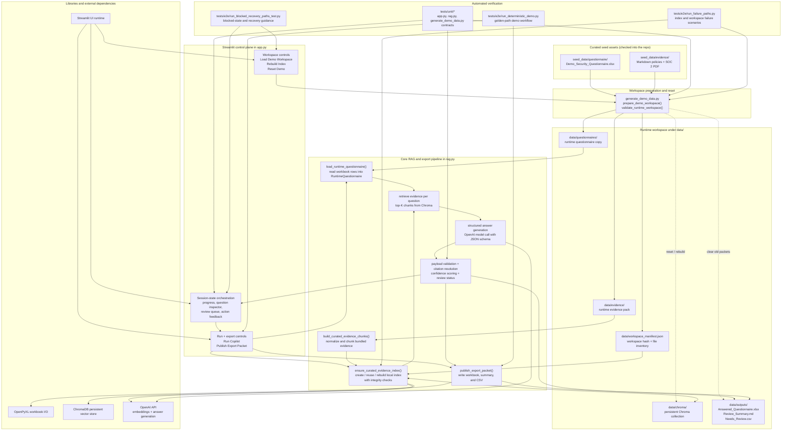

# Security Questionnaire Agent

Local demo scaffold for a Streamlit workflow that answers one curated security questionnaire from one bundled evidence pack, shows source-backed evidence, and exports reviewer handoff files.

## Architecture


### How to read the diagram
- `generate_demo_data.py` is the workspace bootstrapper. It copies the curated assets from `seed_data/` into `data/`, rebuilds the workspace manifest, and can clear cached Chroma or prior output artifacts.
- `app.py` is the UI orchestrator only. It owns Streamlit session state, buttons, progress, and operator guidance, then delegates the real pipeline work to `generate_demo_data.py` and `rag.py`.
- `rag.py` owns the core system behavior: questionnaire loading, evidence chunking, local index lifecycle, retrieval, structured answer generation, validation, confidence scoring, and export publishing.
- `data/chroma/` is a persistent local cache. The app can reuse it when the workspace hash and chunk inventory still match, or rebuild it when integrity checks or workspace changes require that.
- `data/outputs/` is the reviewer handoff area. The final export packet contains the answered workbook, the markdown review summary, and the CSV queue of questions that still need manual review.
- The verification layer exercises the same architecture from multiple angles: unit tests lock the contracts, while deterministic end-to-end scripts cover the golden path, failure paths, and blocked-state recovery behavior.

## Setup
Install the repo dependencies and set the OpenAI key used by the live-provider path:

```bash
pip install -r requirements.txt
cp .env.example .env
```

Set `OPENAI_API_KEY` in `.env`, or export it in your shell before running the app.

## Run
Prepare the runtime workspace from the bundled seed assets:

```bash
python generate_demo_data.py
```

Launch the Streamlit entrypoint from the repo root:

```bash
streamlit run app.py
```

## Outputs
The review packet is written to `data/outputs/`:
- `Answered_Questionnaire.xlsx`
- `Review_Summary.md`
- `Needs_Review.csv`

## Verification
Quick confidence check:

```bash
python -m unittest discover -s tests/unit -p '*_test.py' -v
```

Shared full local validation contract for the remaining automation beads:

```bash
python -m unittest discover -s tests/unit -p '*_test.py' -v
python -m unittest tests.unit.app_test -v
python tests/e2e/run_deterministic_demo.py --log-dir data/outputs/verification/e2e --verbose
python tests/e2e/run_failure_paths.py --log-dir data/outputs/verification/e2e --verbose
python tests/e2e/run_blocked_recovery_paths_test.py --log-dir data/outputs/verification/e2e --verbose
```

Use `br-closeout-audit --issue <issue-id>` before closing high-risk beads and again after verification-heavy test or logging changes.
